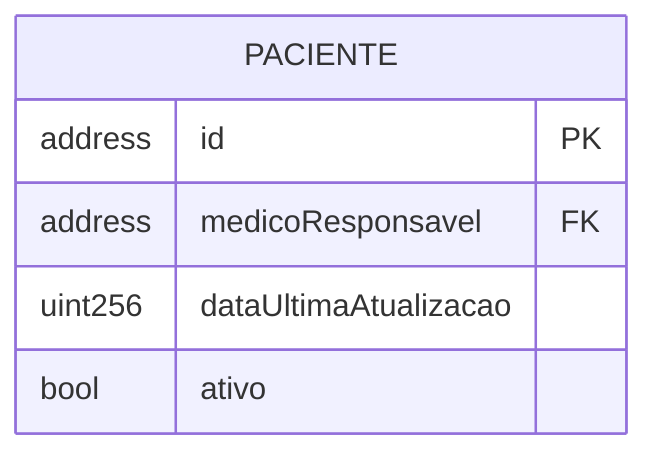

## **MedVault**: Prova de conceito para Monitorização de Testes Clinicos e Procedimentos Médicos

O objetivo é desenvolver um sistema de gestão de informações hospitalares descentralizado, baseado em contratos inteligentes (smart contracts), para permitir o acompanhamento dos procedimentos e testes clinicos realizados no Hospital Universitario (HU). O sistema será dividido em módulos independentes, mas interoperáveis, garantindo segurança, rastreabilidade e privacidade. 

Para garantir a funcionalidade do sistema a interação entre os contratos *on-chain* é para a orquestração e validação de todo o fluxo de dados.

Abaixo estão os módulos que comporão o sistema. Teríamos um total de **5 módulos principais**:

1. **Descrição dos Módulos**
    1.  [**Módulo de Pacientes**](#1-módulo-de-pacientes)
    2.  [**Módulo de Profissionais de Saúde**](#2-módulo-de-profissionais-de-saúde)
    3.  [**Módulo de Controle de Estoque**](#3-módulo-de-controle-de-estoque)
    4.  [**Módulo de Procedimentos**](#4-módulo-de-procedimentos)
    5.  [**Módulo de Controle de Acesso e Relatórios**](#5-módulo-de-controle-de-acesso-e-relatórios)
1. [**Interfaces dos Módulos**](#interfaces-api-vs-jsdapp)
1. [**Fases do projeto**](#as-fases-do-projeto)

## Descrição dos Módulos

Na seções abaixo são descritos os modulos

### **1. Módulo de Pacientes**

Este contrato gerencia a identidade digital dos pacientes, com foco principal na privacidade.

*   Para garantir a privacidade e o controle do paciente sobre seus dados, será utilizado o conceito de "anonimato de Satoshi" [^1]. Cada paciente não terá uma única identidade, mas sim um conjunto de endereços de carteira (wallets) que pode utilizar. Isso dificulta a correlação de todos os procedimentos a uma única identidade pública na blockchain.
    *   **Re-identificação:** Apenas um endereço com privilégios especiais, o do **Diretor Médico**, terá a capacidade de consultar (em um mécanismo off-chain) um mapeamento que liga os endereços das wallets a um identificador interno do paciente no sistema do hospital. Essa operação deve ser registrada em um log de eventos para auditoria.
* **Dados dos paciente**: O contrato de pacientes não armazenará dados pessoais. Ele funcionará como um registro que associa um ou mais endereços a um histórico de procedimentos. A estrutura de dados deve ser pensada para permitir que um endereço consulte os procedimentos associados a ele. Sugestão:

[^1] : Sabemos da limitação mas para fins desse projeto será suficiênte

### **2. Módulo de Profissionais de Saúde**

Este contrato/conjunto de contrato funcionará como um registro de identidades para todos os profissionais de saúde autorizados a interagir com o sistema.

*   **Função:** Validar se o responsável por um procedimento é um profissional ativo e habilitado.
*   **Dados a serem armazenados no contrato:**
    *   Uma `struct Profissional` contendo:
        *   `string nome;`
        *   `uint idProfissionalHospital;` (ID do sistema legado do hospital)
        *   `enum Categoria { Medico, Enfermeiro, Dentista, Fisioterapeuta } categoria;`
        *   `string registroConselho;` (Ex: CRM, COREN, etc.)
        *   `address wallet;` (A carteira que o profissional usará para assinar transações)
        *   `bool ativo;`
    *   `mapping(address => Profissional) private profissionais;`: Mapeia o endereço da wallet de um profissional à sua estrutura de dados.
    *   `event ProfissionalRegistrado(address indexed wallet, uint idProfissionalHospital);`

### **3. Módulo de Controle de Estoque**

Este é um módulo gerencia o catálogo de materiais e medicamentos do hospital. Ele não controla a quantidade (que é gerida pelo sistema legado), mas sim a validade e existência dos itens.

*   **Função:** Servir como uma base de dados para o Módulo de Procedimentos validar os materiais utilizados. Um procedimento não pode ser registrado com um item que não existe ou não está catalogado neste contrato.
*   **Dados a serem armazenados no contrato:**
    *   Uma `struct ItemEstoque` contendo:
        *   `uint idItemHospital;` (ID que vem do sistema principal do hospital)
        *   `string lote;`
        *   `uint dataValidade;` (em formato timestamp)
        *   `enum categoria;` (Ex: "Antibiótico", "Material Cirúrgico", "Sutura")
        *   `bool altoCusto;` item de alto custo que deve ser notificado ao diretor médico todas as vezes que for utilizado em algum procedimento
    *   `mapping(uint => ItemEstoque) private catalogoItens;`: Mapeia o ID do item à sua estrutura de dados.
    *   `event ItemCatalogado(uint indexed idItemHospital);`
    *   `event ItemUtilizado(uint indexed idItemHospital);`

### **4. Módulo de Procedimentos**

Este é o contrato central do sistema, orquestrando informações dos outros módulos para registrar cada ato do profissional de saúde.

*   **Interação:**
    *   Ao registrar um procedimento, ele deve validar se o endereço do `responsavel` existe e está ativo no **Módulo de Profissionais**. E lancar um evento indexado pelo profissional e tipo!
    *   Deve validar se o `id_paciente_wallet` existe no **Módulo de Pacientes**.
    *   Para cada material utilizado, deve validar se o `id_item` existe no **Módulo de Controle de Estoque**. Se um item não estiver cadastrado, a transação inteira deve falhar (reverter).
*   **Extensibilidade:** O contrato deve permitir o cadastro de novos tipos de procedimento pelo Diretor Médico, sem necessidade de reimplantar o contrato.
*   **Notificação de Intercorrência:** Se um procedimento for marcado com o campo `intercorrencia` como `true`, o contrato deve emitir um evento específico. Um serviço off-chain (externo à blockchain) deve estar escutando por este evento para notificar o Diretor Médico imediatamente (via e-mail, SMS, etc.).
*   **Dados a serem armazenados no contrato:**
    *   Uma `struct MaterialUtilizado` contendo:
        *   `uint idItemHospital;`
        *   `uint quantidade;`
    *   Uma `struct Procedimento` contendo:
        *   `uint idProcedimento;` (um contador sequencial)
        *   `address id_paciente_wallet;` (a wallet do paciente usada neste procedimento)
        *   `address responsavel;` (a wallet do profissional de saúde)
        *   `string tipoProcedimento;` (Ex: "Cirurgia", "Curativo", "Sessão de Fisioterapia")
        *   `uint data;` (em formato timestamp)
        *   `MaterialUtilizado[] materiais;` (um array com os materiais e suas quantidades)
        *   `bool intercorrencia;`
    *   `mapping(uint => Procedimento) private procedimentos;`
    *   `string[] public tiposDeProcedimentoPermitidos;` (Array com os tipos permitidos)
    *   `event ProcedimentoRegistrado(uint indexed idProcedimento, address indexed paciente, address indexed responsavel);`
    *   `event NotificacaoIntercorrencia(uint indexed idProcedimento, address indexed responsavel);`

### **5. Módulo de Controle de Acesso e Relatórios**

Este módulo define as regras de quem pode fazer o quê e fornece as funções para extrair dados consolidados do sistema.

*   **Controle de Acesso:**
    *   O sistema usará um controle de acesso baseado em papéis (Role-Based Access Control).
    *   Haverá papéis distintos como `DIRETOR_MEDICO`, `PROFISSIONAL_SAUDE`, e `ADMIN_SISTEMA`.
    *   O endereço do `DIRETOR_MEDICO` será definido na implantação do contrato e terá permissões especiais (ver pacientes, cadastrar procedimentos).
    *   As funções de escrita nos contratos (ex: `registrarProcedimento`) serão protegidas por modificadores que verificam o papel do chamador (ex: `onlyRole(PROFISSIONAL_SAUDE)`).

*   **Módulo de Relatórios:**
    *   Este módulo não armazenará dados duplicados, mas sim fornecerá funções de leitura (`view`/`pure`) que consultam os dados do **Módulo de Procedimentos**.
    *   **Função principal:** `listarProcedimentos(Filtros) returns (Procedimento[])`.
    *   **Filtros Simples:** A função aceitará uma estrutura de `Filtros` que pode incluir:
        *   `address paciente_wallet`
        *   `address responsavel_wallet`
        *   `string tipoProcedimento`
        *   `uint dataAgendamento`
        *   `uint dataRealizacao`
    *   A função irá iterar pelos procedimentos armazenados e retornar um array com aqueles que correspondem aos filtros. É importante notar que filtros complexos em chain podem ser custosos (em "gás").

## **Interfaces (API vs. JS/DApp)**

Considerando o volume e a complexidade, a sugestão para os grupos de alunos seria:

*   **Módulo de Procedimentos:** Uma **API** ou **JS** seria a interface prioritária para interagir com este módulo, pois pode gerenciar a complexidade das chamadas e se integrar aos sistemas existentes do hospital.
*   **Módulo de Controle de Estoque:** A lógica do contrato é de um catálogo, mas ele será intensamente consultado. Uma **API** ou **JS** para o sistema de almoxarifado do hospital popular e gerenciar este catálogo seria o mais eficiente.
*   **Módulo de Pacientes e Módulo de Profissionais:** Ambos são essencialmente contratos de registro. A lógica on-chain simples (adicionar, desativar, verificar existência). São excelentes candidatos para que os alunos implementem **ambas as interfaces** a exemplo:
    1.  Uma **API** para o sistema de RH/Cadastro do hospital gerenciar os registros.
    2.  Uma **Interface JS (DApp com Metamask)** para que um administrador ou o próprio profissional possa visualizar seus dados.
*   **Módulo de Relatórios e Controle de Acesso:** A função de relatório no contrato é apenas de leitura. Em razão disso gostaria de um front-end **Interface JS (DApp)**, onde o grupo criará uma tela de filtros que consome os dados do contrato via Metamask e os exibe em tabelas:
    1. Listagem dos procedimento realizados com alguns filtros
    2. Busca dos procedimentos que utilizaram um insumo (do estoque) por `tipo` ou com o `lote` especifico!

agora o relatorio só será exibido se a carteira for de um profissional de saúde ou do diretor médico. 

Sumário:

| Módulo | Grupo | Interface Sugerida | 
| :--- | :--- | :--- |
| **Gestão de Pacientes** | Grupo X | API **e** JS |
| **Cadastro de Profissionais** | Grupo X | API **e** JS | 
| **Controle de Estoque** | Grupo X | API **ou** JS | 
| **Registro de Procedimentos** | Grupo X | API **ou** JS | 
| **Acesso e Relatórios**| Grupo X | Interface JS | 

## Metodologia de Trabalho 

Adotaremos uma metodologia de trabalho estruturada que simula um ambiente de desenvolvimento profissional. Este guia descreve nosso fluxo de trabalho, a estratégia de branches e as responsabilidades de cada grupo ao longo do projeto.

### As Fases do Projeto

Dividiremos nosso trabalho em quatro fases distintas.

1. Desenho, Documentação e Planejamento
1. Implementação dos Contratos Inteligentes
1. Implementação das Interfaces (API e/ou DApp)
1. Integração Final e Apresentação

Cada fase e descrita abaixo

#### Fase 1: Desenho, Documentação e Planejamento

Antes de escrever qualquer código, todos os grupos se reunirão para definir a arquitetura do sistema. O resultado principal será um único documento chamado `SPECIFICATION.md` na pasta `docs` do nosso repositório. Este arquivo detalhará as assinaturas exatas de cada função, as estruturas de dados (`structs`) e os eventos de cada contrato inteligente, etc... Este é o momento de concordar sobre como os diferentes módulos do sistema conversarão entre si.

Cada grupo, pode cirar um arquivo `.md`, exemplo `modulo_paciente.md` na pasta `docs` que ao final sera referenciado pelo `SPECIFICATION.md`.

#### Fase 2: Implementação dos Contratos Inteligentes

Cada grupo criará sua própria branch a partir da `develop` e começará a implementar os contratos pelos quais é responsável. 

Quando um grupo finalizar uma parte funcional do seu contrato, ele abrirá um **Pull Request (PR)**. Este é um pedido formal para mesclar o trabalho da branch do grupo na branch `develop`. O professor, e idealmente membros de outros grupos, revisarão o código, sugerirão melhorias e, finalmente, aprovarão a integração. Nenhum código entra na `develop` sem revisão.

Se um grupo precisar de uma função que outro grupo acabou de criar, ele não deve puxar o código diretamente da branch do outro grupo. Em vez disso, o grupo que criou a função deve primeiro integrá-la à `develop` via PR. Depois, o grupo que precisa da função simplesmente atualiza sua própria branch a partir da `develop` para receber a novidade. A `develop` é nossa única fonte de verdade para o trabalho integrado.

#### Fase 3: Implementação das Interfaces (API e/ou DApp)

Depois que os contratos estiverem na blockchain, precisaremos de uma maneira para os usuários interagirem com eles. Nesta fase, os grupos construirão as interfaces, que podem ser um site (DApp) ou uma API de backend.

O processo de trabalho é exatamente o mesmo da fase anterior. O desenvolvimento acontece na branch do grupo, e as funcionalidades prontas são integradas à branch `develop` por meio de Pull Requests revisados.

#### Fase 4: Integração Final e Apresentação

Nesta última fase, garantiremos que todas as peças do quebra-cabeça se encaixam perfeitamente. Todos os grupos realizarão testes de integração no sistema completo, que estará implantado em uma rede de testes comum. O objetivo é caçar e corrigir bugs que só aparecem quando os diferentes módulos interagem.

Ao final, após a apresentação do projeto e os ajustes finais, o professor fará o último e mais importante merge: da branch `develop` para a `main`. Isso marcará a conclusão oficial do projeto, deixando a branch `main` como um registro limpo e funcional do nosso trabalho, servindo como um excelente portfólio para todos os envolvidos.

### Branches

A branch **`main`** será gerênciada pelo profgessor. Ela representa o produto final, estável e completo. Ninguém, exceto o professor, poderá enviar código diretamente para ela. Esta branch é o destino final do nosso trabalho.

A branch **`develop`** é onde a mágica acontece. Ela servirá como a branch de integração principal, refletindo o estado atual do desenvolvimento do projeto. Todas as funcionalidades finalizadas e revisadas pelos grupos serão incorporadas aqui antes de seguirem para a `main`.

Cada grupo trabalhará em sua própria **branch de longa duração**, que será criada a partir da `develop`. Por exemplo, `grupo-pacientes` ou `grupo-estoque`. Todo o desenvolvimento diário, testes e experimentos de um grupo ocorrerão isoladamente nesta branch, sem afetar o trabalho dos outros.

Nosso fluxo de trabalho pode ser resumido da seguinte forma: o código flui da `develop` para as branches dos grupos, e retorna para a `develop` através de um processo de revisão chamado Pull Request.
