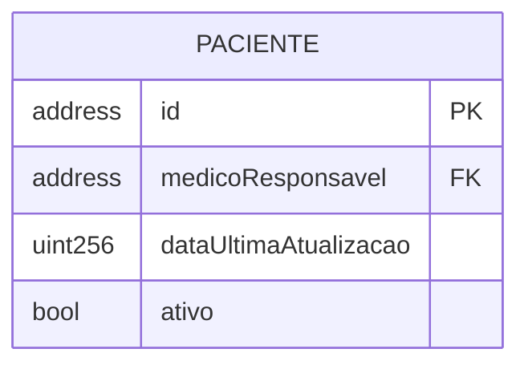

## **MedVault**: Especificação DAPP

O objetivo é desenvolver um sistema de gestão de informações hospitalares descentralizado, baseado em contratos inteligentes (smart contracts), para permitir o acompanhamento dos procedimentos e testes clinicos realizados no Hospital Universitario (HU). O sistema será dividido em módulos independentes, mas interoperáveis, garantindo segurança, rastreabilidade e privacidade. 

Para garantir a funcionalidade do sistema a interação entre os contratos *on-chain* é para a orquestração e validação de todo o fluxo de dados.

Abaixo estão os módulos que comporão o sistema. Teríamos um total de **5 módulos principais**:

1. **Descrição dos Módulos**
    1.  [**Módulo de Pacientes**](#1-módulo-de-pacientes)
    2.  [**Módulo de Profissionais de Saúde**](#2-módulo-de-profissionais-de-saúde)
    3.  [**Módulo de Controle de Estoque**](#3-módulo-de-controle-de-estoque)
    4.  [**Módulo de Procedimentos**](#4-módulo-de-procedimentos)
    5.  [**Módulo de Controle de Acesso e Relatórios**](#5-módulo-de-controle-de-acesso-e-relatórios)

## Descrição dos Módulos

Na seções abaixo são descritos os modulos

### **1. Módulo de Pacientes**

Este contrato gerencia a identidade digital dos pacientes, com foco principal na privacidade.

*   Para garantir a privacidade e o controle do paciente sobre seus dados, será utilizado o conceito de "anonimato de Satoshi" [^1]. Cada paciente não terá uma única identidade, mas sim um conjunto de endereços de carteira (wallets) que pode utilizar. Isso dificulta a correlação de todos os procedimentos a uma única identidade pública na blockchain.
    *   **Re-identificação:** Apenas um endereço com privilégios especiais, o do **Diretor Médico**, terá a capacidade de consultar (em um mécanismo off-chain) um mapeamento que liga os endereços das wallets a um identificador interno do paciente no sistema do hospital. Essa operação deve ser registrada em um log de eventos para auditoria.
* **Dados dos paciente**: O contrato de pacientes não armazenará dados pessoais. Ele funcionará como um registro que associa um ou mais endereços a um histórico de procedimentos. A estrutura de dados deve ser pensada para permitir que um endereço consulte os procedimentos associados a ele. 

Sugestão:

[^1] : Sabemos da limitação mas para fins desse projeto será suficiênte

### **2. Módulo de Profissionais de Saúde**

Este contrato/conjunto de contrato funcionará como um registro de identidades para todos os profissionais de saúde autorizados a interagir com o sistema.

*   **Função:** Validar se o responsável por um procedimento é um profissional ativo e habilitado.
*   **Dados a serem armazenados no contrato:**
    *   Uma `struct Profissional` contendo:
        *   `string nome;`
        *   `uint idProfissionalHospital;` (ID do sistema legado do hospital)
        *   `enum Categoria { Medico, Enfermeiro, Dentista, Fisioterapeuta } categoria;`
        *   `string registroConselho;` (Ex: CRM, COREN, etc.)
        *   `address wallet;` (A carteira que o profissional usará para assinar transações)
        *   `bool ativo;`
    *   `mapping(address => Profissional) private profissionais;`: Mapeia o endereço da wallet de um profissional à sua estrutura de dados.
    *   `event ProfissionalRegistrado(address indexed wallet, uint idProfissionalHospital);`

### **3. Módulo de Controle de Estoque**

Este é um módulo gerencia o catálogo de materiais e medicamentos do hospital. Ele não controla a quantidade (que é gerida pelo sistema legado), mas sim a validade e existência dos itens.

*   **Função:** Servir como uma base de dados para o Módulo de Procedimentos validar os materiais utilizados. Um procedimento não pode ser registrado com um item que não existe ou não está catalogado neste contrato.
*   **Dados a serem armazenados no contrato:**
    *   Uma `struct ItemEstoque` contendo:
        *   `uint idItemHospital;` (ID que vem do sistema principal do hospital)
        *   `string lote;`
        *   `uint dataValidade;` (em formato timestamp)
        *   `enum categoria;` (Ex: "Antibiótico", "Material Cirúrgico", "Sutura")
        *   `bool altoCusto;` item de alto custo que deve ser notificado ao diretor médico todas as vezes que for utilizado em algum procedimento
    *   `mapping(uint => ItemEstoque) private catalogoItens;`: Mapeia o ID do item à sua estrutura de dados.
    *   `event ItemCatalogado(uint indexed idItemHospital);`
    *   `event ItemUtilizado(uint indexed idItemHospital);`

### **4. Módulo de Procedimentos**

Este é o contrato central do sistema, orquestrando informações dos outros módulos para registrar cada ato do profissional de saúde.

*   **Interação:**
    *   Ao registrar um procedimento, ele deve validar se o endereço do `responsavel` existe e está ativo no **Módulo de Profissionais**. E lancar um evento indexado pelo profissional e tipo!
    *   Deve validar se o `id_paciente_wallet` existe no **Módulo de Pacientes**.
    *   Para cada material utilizado, deve validar se o `id_item` existe no **Módulo de Controle de Estoque**. Se um item não estiver cadastrado, a transação inteira deve falhar (reverter).
*   **Extensibilidade:** O contrato deve permitir o cadastro de novos tipos de procedimento pelo Diretor Médico, sem necessidade de reimplantar o contrato.
*   **Notificação de Intercorrência:** Se um procedimento for marcado com o campo `intercorrencia` como `true`, o contrato deve emitir um evento específico. Um serviço off-chain (externo à blockchain) deve estar escutando por este evento para notificar o Diretor Médico imediatamente (via e-mail, SMS, etc.).
*   **Dados a serem armazenados no contrato:**
    *   Uma `struct MaterialUtilizado` contendo:
        *   `uint idItemHospital;`
        *   `uint quantidade;`
    *   Uma `struct Procedimento` contendo:
        *   `uint idProcedimento;` (um contador sequencial)
        *   `address id_paciente_wallet;` (a wallet do paciente usada neste procedimento)
        *   `address responsavel;` (a wallet do profissional de saúde)
        *   `string tipoProcedimento;` (Ex: "Cirurgia", "Curativo", "Sessão de Fisioterapia")
        *   `uint data;` (em formato timestamp)
        *   `MaterialUtilizado[] materiais;` (um array com os materiais e suas quantidades)
        *   `bool intercorrencia;`
    *   `mapping(uint => Procedimento) private procedimentos;`
    *   `string[] public tiposDeProcedimentoPermitidos;` (Array com os tipos permitidos)
    *   `event ProcedimentoRegistrado(uint indexed idProcedimento, address indexed paciente, address indexed responsavel);`
    *   `event NotificacaoIntercorrencia(uint indexed idProcedimento, address indexed responsavel);`

### **5. Módulo de Controle de Acesso e Relatórios**

Este módulo define as regras de quem pode fazer o quê e fornece as funções para extrair dados consolidados do sistema.

	⚠️ Como a turma foi dividida em 4 grupos este modulo não será implementado. Desse modo alguns modulos terão que implementar algumas checagens. 

    - Módulo de Pacientes : Só aceitara o cadastro de responsaveis que estejam cadastrados no módulo de profissionais de saúde.
    - Módulo de Estoque : Só aceitara o cadastro de itens se a carteira que iniciou a transação sejá de um profissional cadastrado no módulo de profissionais de saúde.
    - Módulo de Estoque : Só aceitara o cadastro de procedimentos se a carteira que iniciou a transação sejá de um profissional cadastrado no módulo de profissionais de saúde.