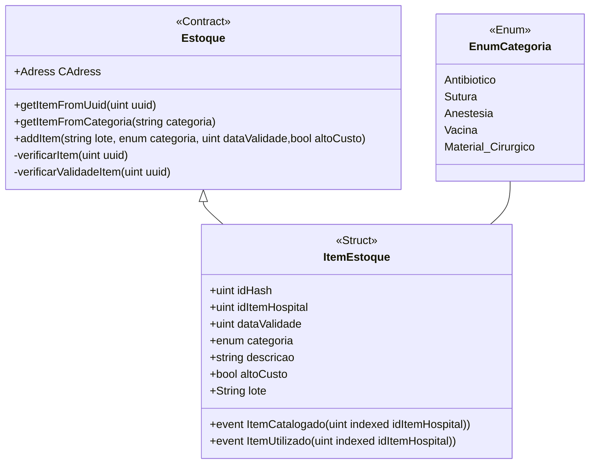

```mermaid
classDiagram
direction TB
    class EnumCategoria {
	    Antibiotico
	    Sutura
	    Anestesia
	    Vacina
	    Material_Cirurgico
    }

    class ItemEstoque {
	    +uint idHash
	    +uint idItemHospital
	    +uint dataValidade
	    +enum categoria
	    +string descricao
	    +bool altoCusto
	    +String lote
	    +event ItemCatalogado(uint indexed idItemHospital))
	    +event ItemUtilizado(uint indexed idItemHospital))
    }

    class Estoque {
	    +Adress CAdress
	    +getItemFromUuid(uint uuid)
	    +getItemFromCategoria(string categoria)
	    +addItem(string lote, enum categoria, uint dataValidade,bool altoCusto)
	    -verificarItem(uint uuid)
	    -verificarValidadeItem(uint uuid)
    }

	<<Enum>> EnumCategoria
	<<Struct>> ItemEstoque
	<<Contract>> Estoque

    Estoque <|-- ItemEstoque
    EnumCategoria -- ItemEstoque
```

