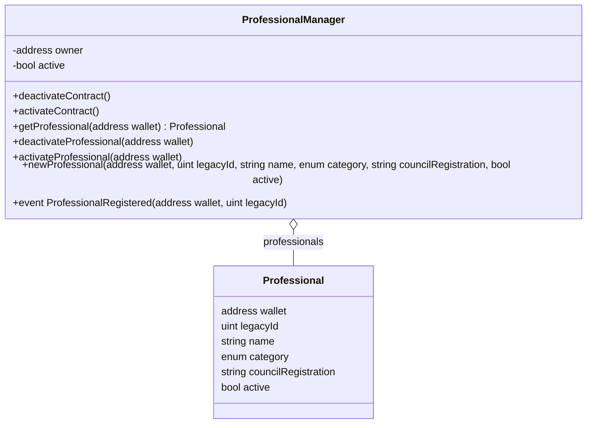

```mermaid
classDiagram
struct Professional
Professional : address wallet
Professional : uint legacyId
Professional : string name
Professional : enum category
Professional : string councilRegistration
Professional : bool active

class ProfessionalManager
ProfessionalManager : -address owner
ProfessionalManager : -bool active
ProfessionalManager : +deactivateContract()
ProfessionalManager : +activateContract()
ProfessionalManager : +getProfessional(address wallet) Professional
ProfessionalManager : +deactivateProfessional(address wallet)
ProfessionalManager : +activateProfessional(address wallet)
ProfessionalManager : +newProfessional(address wallet, uint legacyId, string name, enum category, string councilRegistration, bool active)
ProfessionalManager : +event ProfessionalRegistered(address wallet, uint legacyId)

ProfessionalManager o-- Professional : professionals
```
