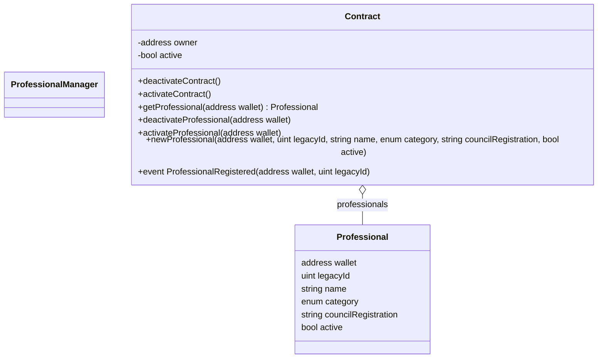

```mermaid
classDiagram
struct Professional
Professional : address wallet
Professional : uint legacyId
Professional : string name
Professional : enum category
Professional : string councilRegistration
Professional : bool active

class ProfessionalManager
Contract : -address owner
Contract : -bool active
Contract : +deactivateContract()
Contract : +activateContract()
Contract : +getProfessional(address wallet) Professional
Contract : +deactivateProfessional(address wallet)
Contract : +activateProfessional(address wallet)
Contract : +newProfessional(address wallet, uint legacyId, string name, enum category, string councilRegistration, bool active)
Contract : +event ProfessionalRegistered(address wallet, uint legacyId)

Contract o-- Professional : professionals
```
